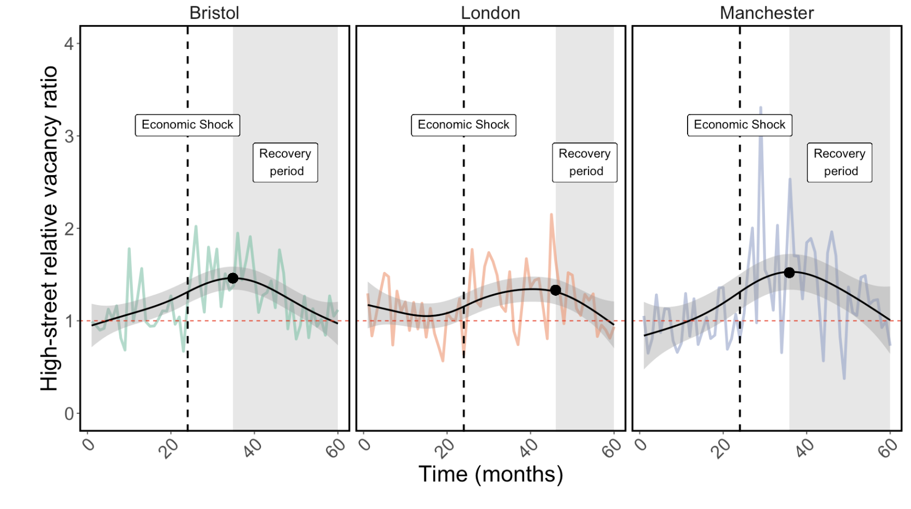

# Analysis-of-high-street-vacancy-rates
Using simulated data, this script engineers a feature - the "relative vacancy rate" - that describes the economic performance of a particular property class (e.g., high-street retail) relative to a local average. It does so for several cities and models how the relative vacancy rate responds in each when exposed to an economic shock.

The final output of the script displays changes in the relative high-street vacancy rates in three cities in response to an economic shock. The relative high-street vacancy rate, expressed as a ratio, was calculated separately for each city by dividing high-street property vacancy rates by the mean vacancy rates of all other asset classes
